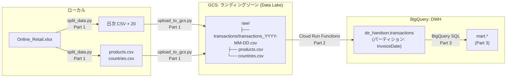

# GCP データエンジニアリング入門 ハンズオン

GCP を使ったデータエンジニアリングの入門シリーズです。  
UCI Online Retail Dataset（英国小売店の取引データ）を題材に、データの取り込みからマート構築までを実装します。

## シリーズ構成

| #  | テーマ                                   | 主な技術                              | 状態 |
|----|------------------------------------------|---------------------------------------|------|
| 1  | GCS へのデータ取り込みとプロファイリング | GCS, pandas, ydata-profiling          | 完了 |
| 2  | データクレンジングと BigQuery へのロード | Cloud Run Functions, BigQuery, pandas | 完了 |
| 3  | 集計マートの構築と可視化                 | BigQuery SQL, Looker Studio           | 予定 |

## アーキテクチャ



GCS は**ランディングゾーン（Data Lake）** として生データのみを保管します。  
変換・集計は BigQuery（DWH）側で行うのが GCP のベストプラクティスです。

## データセット

**UCI Online Retail Dataset** — 2010年の英国小売店の取引データ（約54万行）  
出典: Chen, D. (2015). [Online Retail](https://doi.org/10.24432/C5BW33). UCI Machine Learning Repository. CC BY 4.0

- 期間: 2010-12-01 〜 2010-12-23（20日分）
- 主なデータ品質の特徴: `CustomerID` 約37%欠損、キャンセル取引（`InvoiceNo` が C 始まり）が混在

## ディレクトリ構成

```text
.
├── 01_profiling/               # Part 1: データ取り込みとプロファイリング
│   ├── scripts/
│   │   ├── split_data.py       # xlsx → 日次 CSV + マスタファイルに分割
│   │   └── upload_to_gcs.py    # ローカルデータを GCS raw/ にアップロード
│   └── notebooks/
│       └── profiling.ipynb     # データ品質の確認・可視化
│
├── 02_cleaning/                # Part 2: クレンジングと BigQuery ロード
│   ├── cloud_run_function/
│   │   ├── main.py             # Cloud Run Functions エントリポイント
│   │   └── requirements.txt    # 本番依存パッケージ（uv export --no-dev で生成）
│   ├── scripts/
│   │   └── batch_clean_and_load.sh  # 全日付を一括処理するバッチスクリプト
│   └── sql/
│       └── schema.sql          # BigQuery transactions テーブル定義
│
└── data/                       # ローカルデータ置き場（.gitignore で除外済み）
    └── README.md               # データのダウンロード手順
```

## 各回の手順

各回のセットアップ・実行手順は、それぞれのフォルダ内の README にまとめています。

- [01_profiling/README.md](01_profiling/README.md) — データ準備・GCS アップロード・プロファイリング
- [02_cleaning/README.md](02_cleaning/README.md) — BigQuery テーブル作成・Cloud Run Functions デプロイ・一括ロード

## セットアップ

```bash
# 依存パッケージのインストール
uv sync

# GCP 認証
gcloud auth login
gcloud config set project YOUR_PROJECT_ID
```

`data/Online_Retail.xlsx` のダウンロード手順は `data/README.md` を参照してください。
